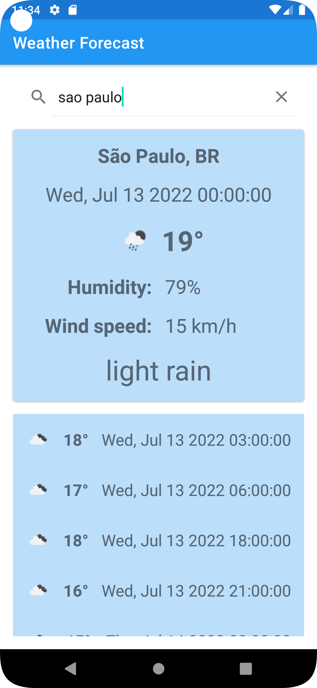
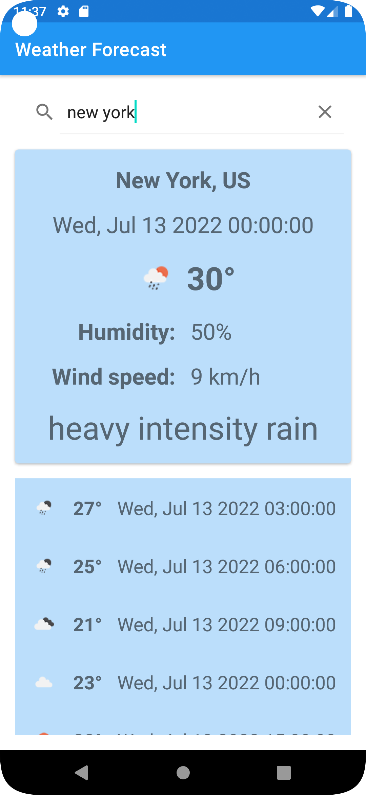
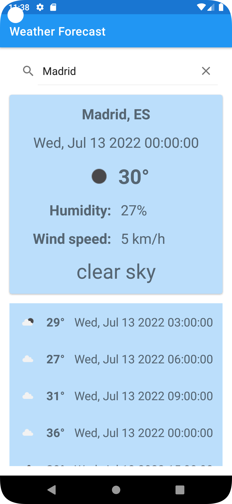
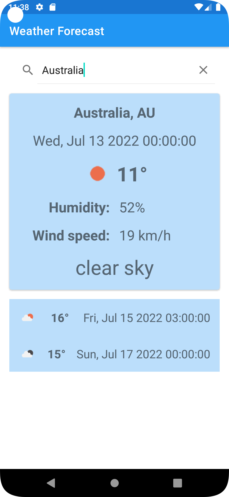
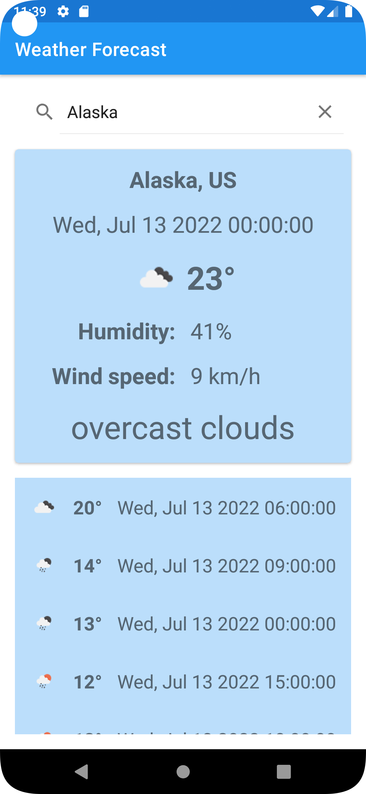
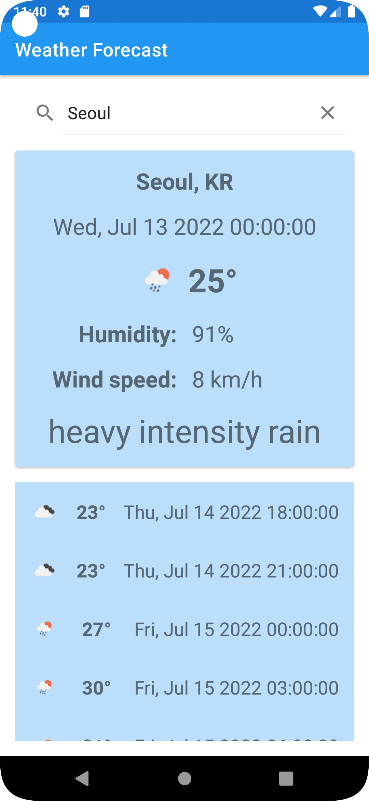

# Weather Forecast App

## Features Requirements:
 * Using any weather APi, request the weather from any location;
 * Create an UI that can show next weather's from this location;
 * Since weather doesn't change frequently we don't need to request all the time, this way we can save mobile data. So create a cache to solve this issue;
 * App must work in landscape and portrait orientation;

## Architecture Requirements:
 * Develop in Kotlin;
 * Use MVVM as architecture;
 * Use Retrofit to request from API and cache;
 * Use LiveData to keep the app lifecycle aware;

## Guide:
 * You may want to use https://openweathermap.org/api.
 * Retrofit: https://square.github.io/retrofit.

## Solution summary:
 * Project has separated into a four main sub-packages inside the 'weatherforecastapp' package.
   * 'data' package (into this package we have other sub-packages as entities, mappers, remote, repository), the idea is allocate here all non visual features, resources that interact directly with data layer.
   * 'di' package (where we have the MainModule for Koin Dependence Injection), to allocate here all the modules and dependencies that will be use in the application.
   * 'domain' package (in this package we have the models and repository sub-packages), the idea is receive here the data provided by the user and perform the necessary.
   * 'extensions' package (this package contains extensions of different classes), that provides the ability to extend a class with new functionalities.
   * 'presenter' package (into this package we have the adapters, fragments, viewHolders and viewModels sub-packages), the idea is allocate here the presentation layer, capturing user events and displaying data.
 * RetrofitService was use to request from API.
   * Was set baseUrl as 'https://api.openweathermap.org/data/2.5/'.
 * Was used the API endpoint: 'forecast' since return a list of next weather's starting by current.
   * ApiService interface define 'getForecasts' method with 'q' and 'APPID' params.
   * 'q' its the API query param, defined as a '{{city}},{{country}}' pair, example: 'Manaus, BR'.
   * 'APPID' param its the API generated-key,  mandatory  for all request.
 * Based on API response were build some models:
   * 'WeatherModel', to attend presentation layer as an already formatted data, ready to be shown.
 * Based on the data models created, the view model was created and the views were designed.
 * 'MainActivity', it's the main activity to inflate the 'activity_main' layout.
 * 'WeatherFragment', it's the main fragment to inflate the 'fragment_weather' layout.
 * 'WeatherViewModel', it's the view model for 'WeatherFragment'.
 * 'ForecastListAdapter', it's the recyclerview adapter to inflate the 'item_weather' layout.
 * 'fragment_weather' layout it's a FrameLayout, compose by, a top search bar, a top CardView enclosing the current weather information, and a RecyclerView enclosing the list of forecasts.
 * Was added 'screenshots' folder with some app images as a preview of the app.

## Solution Requirements:
 * Location access permission.
 * Internet access permission.

## App Screenshots:

### Sample of São Paulo location weather
 * 

 * 

 * 

 * 

 * 

 * 

 * 